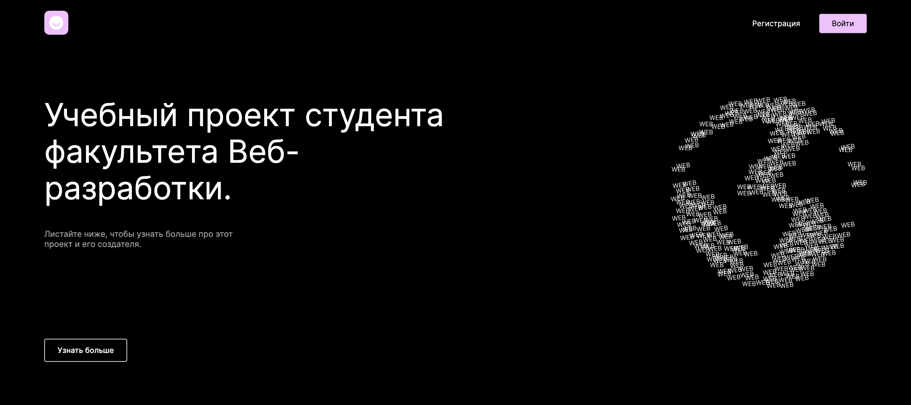

## Frontend часть дипломной работы 

### Дипломная работа представляет собой приложение по поиску фильмов с возможностью регистрации, авторизации, поиска и добавления фильмов.

В данной часте дипломной работы использованы технологии:
- HTML; 
- CSS;
- React.

### [Макет Figma](https://www.figma.com/file/IcE0bNn8q4JO2zgKf9yoK7/Diploma?node-id=932%3A4182)

# Для запуска проектка необходимо:

## Запустить frontend-часть:
- Запустить "GitBash"("Terminal" на Mac OS);
- Выполнить команду "git clone https://github.com/olhasmy/movies-explorer-frontend.git";
- Выполнить команду "cd movies-explorer-frontend";
- Выполнить команду "npm install";
- Выполнить команду "npm start";

## Запустить backend-часть:
- Запустить "GitBash"("Terminal" на Mac OS);
- Выполнить команду "git clone https://github.com/olhasmy/movies-explorer-api.git";
- Выполнить команду "cd movies-explorer-api";
- Выполнить команду "npm install";
- Выполнить команду "npm start";
